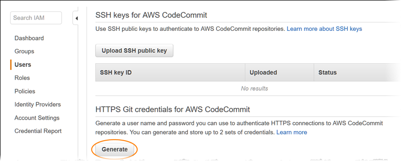

# Amazon EKS from Code to Deploy (Level 100-200)

## Pre-requisites
- AWS Accounts

- IAM user, please create before continue the lab

    http://aws-core-services.ws.kabits.com/getting-started-with-iam

## Recommended Knowledge
- Docker, If you do not know docker, please make sure you take a look at the document below:

    https://aws.amazon.com/th/docker/

    https://docs.aws.amazon.com/AmazonECS/latest/developerguide/docker-basics.html

    https://docs.docker.com/get-started/

- Basic Kubernetes

--- 
## Lab 1: Amazon EKS from Code to Deploy

 ## 1.) Create EKS cluster with following lab url:
    https://www.eksworkshop.com/020_prerequisites/workspace/#region-3

Follow step by step, till you have finished "Test the Cluster"

---
## 2.) Getting VPC ID

     VPCID=$(aws eks describe-cluster --name eksworkshop-eksctl \
    --query "cluster.resourcesVpcConfig.vpcId" \
    --output text)

     echo $VPCID

---
## 3.) Create Security Group and Postgres Database using Amazon RDS

     RDSSG=$(aws ec2 create-security-group --group-name RDSDbAccessSG --description "Security group to apply to apps that need access to RDS" --vpc-id $VPCID --query "GroupId" --output text)

     echo $RDSSG  

Refering the step below to create Amazon RDS Postgres
https://docs.aws.amazon.com/AmazonRDS/latest/UserGuide/CHAP_GettingStarted.CreatingConnecting.PostgreSQL.html#CHAP_GettingStarted.Creating.PostgreSQL

Note:
- Please use "postgres" as username, and password.

Challenge:
- How can you enable inbound traffic from EKS to be able to connect to Amazon RDS Postgres?

- Please take a look document below for Reference:
https://docs.aws.amazon.com/vpc/latest/userguide/VPC_SecurityGroups.html#SecurityGroupRules

---
## 4.) Build docker and push to Amazon ECR

    git clone https://github.com/chatchai-komrangded/eks-code2deploy

    cd eks-code2deploy

    docker build -t postgres-test-demo .

    aws ecr create-repository --repository-name postgres-test-demo
    
    aws ecr get-login-password --region ap-southeast-1 | docker login --username AWS --password-stdin <AWS ACCOUNT ID>.dkr.ecr.ap-southeast-1.amazonaws.com

    docker tag postgres-test <AWS ACCOUNT ID>.dkr.ecr.ap-southeast-1.amazonaws.com/postgres-test-demo:latest

    docker push <AWS ACCOUNT ID>.dkr.ecr.ap-southeast-1.amazonaws.com/postgres-test-demo:latest

 - Please change "AWS ACCOUNT ID" to AWS Account number.  

---
## 5.) Deploy Sample Application 

Let’s deploy our application and test that only the desired pods can access our RDS database. 
Save the following as postgres-test.yaml. Replace the HOST, DATABASE, and USER environment variables with the values 
from the step above where you created the RDS database.

    kubectl apply -f postgres-test.yaml

    kubectl get pod postgres-test

    kubectl describe pod postgres-test

    kubectl get pod postgres-test

Challenge:
- How can you secure database credentials!! I do not want to store in kube manifest file.

- Please reference to sample code here to use AWS Secret manager.
    https://aws.amazon.com/th/secrets-manager/

    https://docs.aws.amazon.com/code-samples/latest/catalog/code-catalog-python-example_code-secretsmanager.html    

---
## 6.) Checking if your pod can connect to Amazon RDS Postgres 

    kubectl logs postgres-test
   
 # Congrats, You are ready to develop your code, and deploy to Amazon EKS !!!

## Lab 2: Build your own CI/CD

##  2.1) Automated CI/CD WITH CODEPIPELINE with Cloudformation
    https://www.eksworkshop.com/intermediate/220_codepipeline  

Please Complete this lab before you Create Manual One Yourself.    

Challenge:
- You will face the error during Automated build, How can you investigate it?

##  2.2) Automated CI/CD WITH CODEPIPELINE with Your own

 1.) Configure AWS CodeCommit: The easiest way to set up AWS CodeCommit is to configure HTTPS Git credentials for AWS CodeCommit. On the user details page in IAM console, choose the Security Credentials tab, and in HTTPS Git credentials for AWS CodeCommit, choose Generate.

2.) **_Create the AWS CodeCommit repository (console)_**

1. Open the AWS CodeCommit console at <https://console.aws.amazon.com/codecommit>

2. On the Welcome page, choose Get Started Now. (If a **_Dashboard_** page appears instead, choose **_Create repository_**.)
3. On the **_Create repository_** page, in the **_Repository name_** box, type **_WebAppRepo_**.
4. In the **_Description_** box, type **_My demonstration repository_**.
5. Choose **_Create repository_** to create an empty AWS CodeCommit repository named **_WebAppRepo_**.

**_Note_** The remaining steps in this tutorial assume you have named your AWS CodeCommit repository **_WebAppRepo_**. If you use a name other than **_WebAppRepo_**, be sure to use it throughout this tutorial. For more information about creating repositories, including how to create a repository from the terminal or command line, see [Create a Repository](http://docs.aws.amazon.com/codecommit/latest/userguide/how-to-create-repository.html).

3.) Clone the Repo
In this step, you will connect to the source repository created in the previous step. Here, you use Git to clone and initialize a copy of your empty AWS CodeCommit repository. Then you specify the user name and email address used to annotate your commits.

From CodeCommit Console, you can get the https clone url link for your repo.
Go to Cloud9 IDE terminal prompt
Run git clone to pull down a copy of the repository into the local repo:
    
    git clone https://git-codecommit.<YOUR-REGION>.amazonaws.com/v1/repos/WebAppRepo

Provide your Git HTTPs credential when prompted. You would be seeing the following message if cloning is successful. warning: You appear to have cloned an empty repository.

4.) Commit changes to Remote Repo

    git clone https://github.com/chatchai-komrangded/eks-workshop-sample-api-service-go.git

    cp eks-workshop-sample-api-service-go/* WebAppRepo/

    cd WebAppRepo/

    git status .

    git add .
    
    git commit -m "First commit"

    git push origin master

5.) At this stage you already successfully migrate code from external repo to fully managed private git. 

Next Challenge:
  - Best way to understand is to Reverse engineer from Cloudformation template in step 2.1, You will Create AWS Codebuild project, and Creating CI/CD in AWS CodePipelines via AWS Console ! 

  - Please follow instructor, We really need you to remember, and undertand for every click.

  - In case you forget!, You can refer How to build CI/CD from zero to deployment as below link
  
    https://aws.amazon.com/getting-started/hands-on/create-continuous-delivery-pipeline-codepipeline-codebuild/?trk=gs_card

---

 ## Optional Useful Lab (Level 200-300)

 ## 1.) DEPLOY THE EXAMPLE MICROSERVICES
    https://www.eksworkshop.com/beginner/050_deploy/

 ## 2.) DEPLOYING MICROSERVICES TO EKS FARGATE
    https://www.eksworkshop.com/beginner/180_fargate/  

 ## 3.) DEPLOYING STATEFUL MICROSERVICES WITH AWS EFS
    https://www.eksworkshop.com/beginner/190_efs/     

 ## 4.) USING SPOT INSTANCES WITH EKS
    https://www.eksworkshop.com/beginner/150_spotworkers/       

 ## 5.) CI/CD WITH CODEPIPELINE
    https://github.com/aws-samples/amazon-eks-cicd-codebuild

 ## 6.) Migration to CodeCommit
    
    https://docs.aws.amazon.com/codecommit/latest/userguide/how-to-migrate-repository-existing.html

    https://github.com/aws-samples/gitlab-to-codecommit-migration

## Reference

https://aws.amazon.com/blogs/containers/introducing-security-groups-for-pods

https://github.com/awsdocs/amazon-eks-user-guide/blob/master/doc_source/security-groups-for-pods.md

https://github.com/awsdocs/amazon-eks-user-guide/blob/master/doc_source/cni-upgrades.md

https://docs.aws.amazon.com/eks/latest/userguide/pod-networking.html

https://eksworkshop.com
